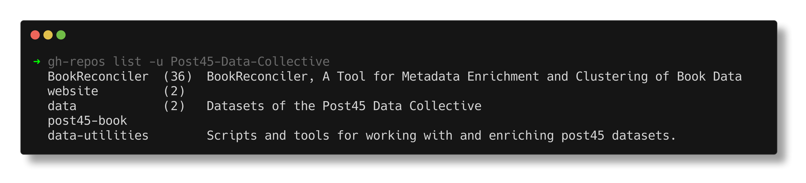

# gh-repos

Clone or fetch all repos; an afternoon hack.

## Install

```shell
$ go install github.com/miku/gh-repos@latest
```

## Run

You can list repos and sync them.

```shell
$ gh-repos list
```



To sync:

```shell
$ gh-repos sync
```

## Usage

```shell
$ gh-repos -h
gh-repos - fetch and manage GitHub repositories

Usage:
  gh-repos list [-u user] [-f]                List repos by name and description
  gh-repos sync [-u user] [-d dir] [-f] [-p pattern]  Clone or pull repos

Environment:
  GITHUB_TOKEN  GitHub personal access token (required)

Subcommands:
  list    List all repositories for a user
  sync    Clone new repos and pull existing ones

Flags:
  -u string  GitHub username (default: authenticated user)
  -f         Force fresh API request, ignoring cache
  -d string  Target directory for cloned repos (sync only, default: ".")
  -p string  Filter repos by name pattern with * wildcards (sync only)
```
